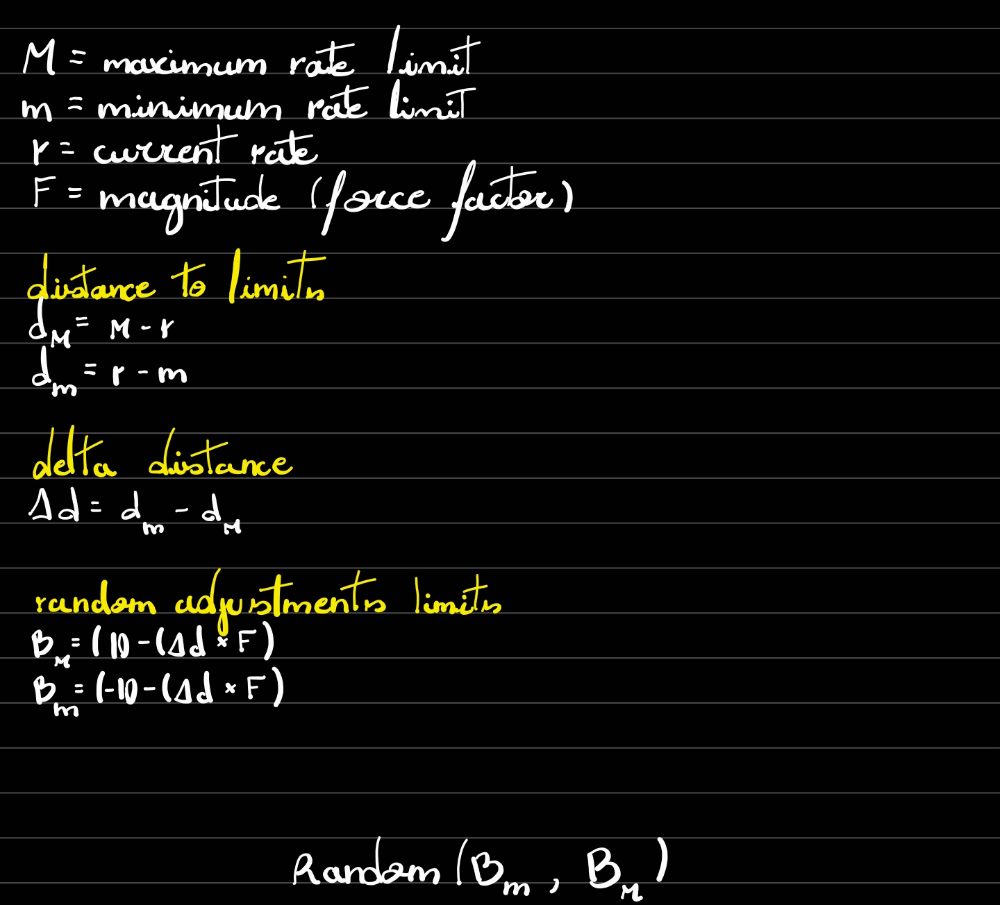

# CDB Investment Calculator

A console application built with C# and .NET 8 that simulates CDB (Certificado de Depósito Bancário) investment growth over time, including monthly deposits and a dynamically changing interest rate.

## About

This project was created as a practical study project to apply C# and .NET concepts beyond.

The application simulates the month-by-month growth of a fixed-income investment, including compound interest, recurring deposits, and changes in the interest rate.

It supports two simulation modes:

* **Direct Mode:** Runs the complete simulation automatically and displays the final report.
* **Interactive Mode:** Allows the user to progress through the simulation month by month, deciding the recurring deposit amount during execution, with options to skip to the end or exit early.

One of the main challenges of the project was designing a mathematical model for a changing interest rate rather than using a fixed value.

## Features

* CDB investment simulation
* Compound interest calculation
* Monthly deposits
* Dynamic interest rate simulation
* Custom mathematical algorithm for rate fluctuations
* Direct and interactive simulation modes
* Detailed simulation history and final report

## Tech Stack

* C# 12
* .NET 8

## Structure

```text
src/
├── Program.cs
├── models/
│   ├── Investment.cs
│   ├── MonthlyEntry.cs
│   └── SimulationLog.cs
├── services/
│   ├── DynamicRates.cs
│   ├── InvestmentCalculator.cs
│   └── SimulationService.cs
└── ui/
    └── ConsoleView.cs
```

## Dynamic Rate Algorithm

Instead of using a fixed interest rate, `DynamicRates.cs` generates a new rate for each month using a custom mathematical algorithm.

The main idea is to make the rate increasingly influenced toward the opposite direction as it approaches either defined limit. This creates controlled fluctuations while keeping the value within the desired range.



The formula was developed from mathematical reasoning and experimentation before being implemented in code. No external library or existing implementation was used for the algorithm.

The resulting behavior produces a self-correcting fluctuation rather than a completely unrestricted random movement.

## What I Learned

This project was an opportunity to apply concepts studied in C# to a complete application.

### C# and Object-Oriented Programming

* Encapsulation and abstraction
* Object composition
* Records
* `required` and `init` properties
* Primary constructors
* Delegates and `Func<T>`

### Software Design

* Separation of responsibilities
* Keeping simulation logic independent from console I/O
* Dependency injection through delegates
* Organizing classes around their responsibilities

## Example Output

```text
==================================================
||            FINAL SIMULATION REPORT           ||
==================================================

Vault Name:        Emergency Fund
Initial Principal: R$ 1.000,00
Total Duration:    12 Month(s)
-----------------------------------------------------------------
Month  | Rate (%)   | Profit       | Balance        | Month Deposit
-----------------------------------------------------------------
1      | 0,848%     | R$ 8,48      | R$ 1.008,48    | + R$ 0,00
2      | 0,838%     | R$ 10,13     | R$ 1.218,61    | + R$ 200,00
3      | 0,838%     | R$ 11,89     | R$ 1.430,49    | + R$ 200,00
...
12     | 0,843%     | R$ 28,59     | R$ 3.419,83    | + R$ 200,00
-----------------------------------------------------------------
Final Balance: R$ 3.419,83 | Total Profit: R$ 219,83
```

## Getting Started

### Requirements

* .NET 8 SDK or later

### Clone the repository

```bash
git clone https://github.com/kkcire/cdb-calculator.git
cd cdb-calculator
```

### Run

```bash
dotnet run --project src
```

---

Built by [Erick Magagna](https://github.com/kkcire) as part of a structured self-study path in back-end development.
